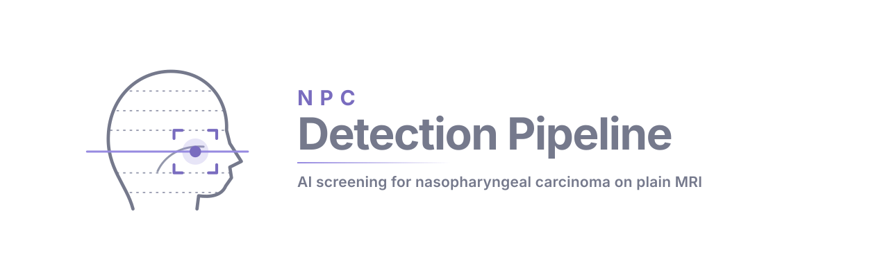
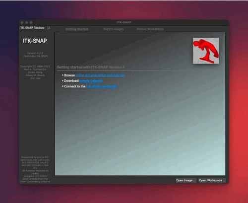

---

# NPC Detection Pipeline

[](https://www.python.org/)
[](https://pytorch.org/)
[](LICENSE)


Nasopharyngeal carcinoma (NPC) is endemic in the Southeast Asia, and more than 95% of their incidences were WHO Type III undifferentiated NPC, which have excellent treatmetn outcome and survival prognosis if it is detected early. However, early NPC is  very difficult to detect, often asymtomatic or cause only non-specific symptoms. Recently, Epstein-Barr Virus (EBV) blood test on plasma DNA has shown great promise, with high sensitivity and specificity and pickup more early NPC (early:advance roughly 7:3), one weakness currently is the PPV, where roughly 1 in 5 patients with postive results had NPC $^{[1]}$. With more early tumors resulting from EBV blood test, it is crucial to be able to localise them in these patients. In this regard, MRI showed better sensitivity when compared to endoscopy$^{[2-4]}$

---

## Pipeline overview

| Step | What it does | Output |
|------|-------------|--------|
| **1. Normalize** | Nyul intensity normalisation + Huang tissue-mask generation | `NyulNormalizer/` + `HuangThresholding/` |
| **2. Localize** | Coarse → grow → fine NPC tumour segmentation (UNetLocTexHistDeeper) | segmentation `.nii.gz` masks |
| **3. Discriminate** | rAIdiologist CNN+Transformer scores malignancy; generates self-attention playback maps | `results.csv` + `SelfAttention/` |

Each step is independently callable, or you can run the full pipeline in one command.

---

## Key feature

* **Flexible framework** -  compatiable with hyperarameter tuning (powered by guildai), model swapping, various input format and augmentation (powered by [torchio](https://torchio.org/))
* **Full-stack end-to-end** - once trained, the pipeline can be applied end-to-end from DICOM to localisation and discrimination result
* **Interpretability enhancement** - discrimination module writes the self-attention weights tha serve as an interpretability heatmap
* **Heatmap viewer** - `streamlit` powered viewer for looking at the results

---

## Quick Start

### Inference

**Full end-to-end pipeline** (DICOM or NIfTI input):

```bash
python cli_inference.py pipeline /path/to/input /path/to/output \
    --rai-checkpoint models_weights/rAIdiologist_B01.pt
```

**Run steps individually:**

```bash
# 1. Normalize raw NIfTI images
python cli_inference.py normalize /data/raw_nii /data/normalized \
    --models-dir models_weights/

# 2. Localize the tumour
python cli_inference.py localize /data/normalized/NyulNormalizer /data/segmentation \
    --probmap-dir /data/normalized/HuangThresholding \
    --id-list 1000,1001

# 3. Score malignancy + generate playback maps
python cli_inference.py discriminate \
    /data/normalized/NyulNormalizer \
    /data/segmentation \
    /data/results \
    --checkpoint models_weights/rAIdiologist_B01.pt \
    --id-list 1000,1001
```

**Output layout:**

```
output/
├── segmentation/          # Post-processed NPC tumour masks (.nii.gz)
├── discrimination/
│   ├── results.csv        # Per-case malignancy probability
│   └── SelfAttention/     # Transformer attention maps (.nii.gz, 20 heads)
└── pipeline.log
```

Add `--debug` to any command to process only the first few cases for a quick sanity check.

#### Reading the self-attention map

In the `SelfAttention` folder, you will find the resampled input ROI with a suffix of `_image` and the transformer self-attention heatmap with a suffix of `_pb_pred` (one `.nii.gz` per case). You can read it directly by loading them in any nii reading software such as [ITK-Snap](https://www.itksnap.org/) by loading the image first and the playback self-attention as 'Additional Image', selecting it as overlay.



#### Results viewer

An interactive Streamlit app for reviewing predictions is in `discrimination_module/ui/results_viewer/`. It overlays the self-attention heatmap on MRI slices with controls for opacity, threshold, and per-head or averaged attention. TP/TN/FP/FN filtering is available when ground-truth labels are provided.

```bash
cd discrimination_module/ui
uv sync          # first time only
uv run viewer-trans
```

On first launch, set the **Image Directory**, **Attention Map Directory**, and **Prediction CSV** in the in-app Configurations panel. Settings persist across sessions automatically.

#### Inference web app (Hugging Face Space)

`app.py` is a Streamlit front-end for inference only. It accepts NIfTI (`.nii` / `.nii.gz`) or DICOM
(`.zip` archives or the files of one series) uploads, exposes the `pipeline` options of `cli_inference.py`,
and shows the malignancy scores, segmentation and self-attention maps with a download of all outputs.

On first start it downloads the weights from the private Hugging Face repo
`mlwong/npc_detection_pipeline_weights` into `./npc_detection_pipeline_weights/` (set `HF_TOKEN`);
a local `models_weights/` directory is used as a fallback.

```bash
pip install streamlit huggingface_hub
HF_TOKEN=hf_xxx streamlit run app.py
```

To publish it as a Docker Space (files in `hf_space/`):

```bash
python hf_space/deploy.py <user>/<space-name> --private
```

Then add `HF_TOKEN` (read access to the weights repo) as a secret in the Space settings.

---

### Training your own model

Training is managed by [Guild AI](https://guild.ai/). All commands below should be run from the respective module directory.

#### Localisation model

```bash
cd localisation_module
guild run localisation:train
guild run localisation:validation   # evaluate on test split
```

See [`localisation_module/README.md`](localisation_module/README.md) for data setup, flags, and cross-validation details.

#### Discrimination model (two-stage)

```bash
cd discrimination_module

# Stage 1 — pretrain the CNN backbone as a binary classifier
guild run rAIdiologist:pretrain

# Stage 2 — train the full CNN + Transformer pipeline
guild run rAIdiologist:train

# Evaluate on test split
guild run rAIdiologist:validation
```

See [`discrimination_module/README.md`](discrimination_module/README.md) for training modes, flags, and the two-stage schedule.

---

## 🚧Docker [WIP]🚧

A `DOCKERFILE` is provided for running the pipeline and guild training operations in a reproducible container.

### Build

```bash
docker build -t npc-pipeline .
```

### Run

Supply three host directories at runtime:

| Flag | Container path | Purpose |
|------|---------------|---------|
| `-v <guild_dir>:/guild-home` | `/guild-home` | Guild run database (experiments, scalars, artefacts) |
| `-v <data_dir>:/data` | `/data` | Patient data — exposed inside the container as `DataDir` |
| `-v <weights_dir>:/workspace/models_weights` | `/workspace/models_weights` | Pre-trained model weight files |

```bash
docker run --gpus all -it \
  -v /host/guild-home:/guild-home \
  -v /host/data:/data \
  -v /host/models_weights:/workspace/models_weights \
  npc-pipeline
```

### Guild operations inside the container

```bash
# Discrimination module
cd /workspace/discrimination_module
guild run rAIdiologist:pretrain --yes
guild run rAIdiologist:train --yes
guild run rAIdiologist:validation --yes

# Localisation module
cd /workspace/localisation_module
guild run localisation:train --yes
```

Guild stores all run artefacts under `/guild-home`, which persists on your host via the bind-mount.

---

## Installation

```bash
# Clone and install in editable mode
git clone <repo-url>
cd npc_detection_pipeline
pip install -e .
```

> **Note:** The `pytorch_med_imaging` (PMI) framework is a required local dependency and must be installed separately from its own repository:
> ```bash
> pip install -e /path/to/pytorch_med_imaging
> ```

Python ≥ 3.9 and PyTorch ≥ 2.0 are recommended. CUDA-capable GPU is required for training; inference also runs on CPU (slowly).

---

## Model weights

Pre-trained weights are **not bundled** in this repository. See [`models_weights/instructions-to-obtain-model-weights.md`](models_weights/instructions-to-obtain-model-weights.md) for download instructions. Place the downloaded files under `models_weights/` following the layout described there.

---

## Repository layout

```
npc_detection_pipeline/
├── cli_inference.py                          # Main CLI entry point
├── pyproject.toml
├── guild.yml                                 # Root proxy for both modules
├── models_weights/
│   ├── checkpoints/NPC_segment_T2WFS_v1.0.pt
│   ├── Normalization-T2w-fs/                 # Nyul normaliser states
│   └── rAIdiologist_B01.pt
├── img/                                      # Repository images
├── localisation_module/                      # Segmentation sub-project
│   ├── README.md
│   └── loctexthist/
└── discrimination_module/                    # rAIdiologist sub-project
    ├── README.md
    └── rAIdiologist/
```

---

## Citation

If you use this pipeline in your research, please consider citing the  manuscript (TBD).

---

## License

Apache 2.0 — see [LICENSE](LICENSE) for details.

## Reference

1.  Chan, K. C. A. et al. Analysis of Plasma Epstein–Barr Virus DNA to Screen for Nasopharyngeal Cancer. N Engl J Med 377, 513–522 (2017).
1. King, A. D. et al. Early Detection of Cancer: Evaluation of MR Imaging Grading Systems in Patients with Suspected Nasopharyngeal Carcinoma. AJNR Am J Neuroradiol 41, 515–521 (2020).
1. King, A. D. et al. Complementary roles of MRI and endoscopic examination in the early detection of nasopharyngeal carcinoma. Annals of Oncology 30, 977–982 (2019).
1. King, A. D. et al. Early detection of nasopharyngeal carcinoma: performance of a short contrast-free screening magnetic resonance imaging. JNCI: Journal of the National Cancer Institute 116, 665–672 (2024).

