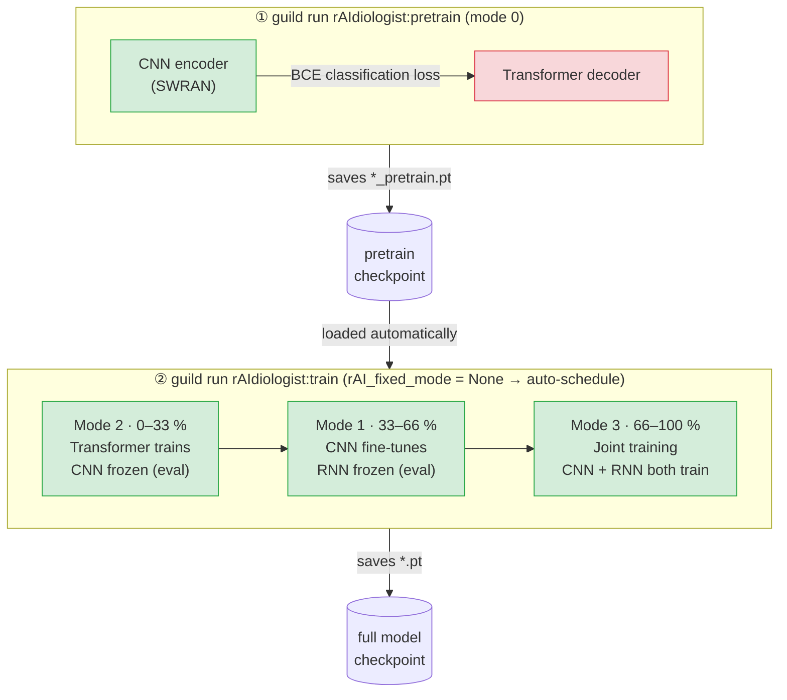

# Discrimination Module

NPC malignancy discrimination via the **rAIdiologist** network: a CNN encoder with transformer decode that votes across sequential 2D slices to produce a per-patient malignancy prediction with option to be interpretability map using the self-attention weights generated by the transformer deoder towards the malignancy query token.

---

## Overview

Training is two-stage:

1. **Pretrain** (`rAIdiologist:pretrain`) — CNN encoder trained as a binary classifier (`rAI_fixed_mode = 0`). Checkpoint saved to `./Backup/rAIdiologist_{fold_code}_pretrain.pt`.
2. **Full train** (`rAIdiologist:train`) — RNN trained on top of the CNN, which may be fine-tuned depending on `rAI_fixed_mode`. Requires a pretrained CNN checkpoint. (See `Steps` below)

All operations are managed by Guild AI. Working directory for Guild commands is `discrimination_module/`.



> Note that the auto schedule isn't that optimal currently. The number of steps can vary with the data demographics, so another way is to use the `rAI_fixed_mode` attribute to manually switch from each of these mode.
>
> More details are available from the manuscript [TBD].

---

## Prerequisites

- Guild AI installed and on PATH (`pip install guildai 'setuptools < 81'`)
- `mri-normalization-tools` install by `pip install mri-normalization-tools`
- `pytorch-medical-imaging` follow instructions [here](https://github.com/ml-w/pytorch_medical_imaging.git)
- Data symlinked at `discrimination_module/DataDir` (Guild resolves this automatically via the `default` resource)
- A patient split `.ini` file (see `example_patient_split.ini` for format)


---

## Training workflow

This workflow assumes that:
- You have normalized the input data
- There are segmentation that guides the ROI cropping step (`probmap` argument)
- Make sure the smallest image size is not smaller than the defined input size in any dimension.

### Using guild Operations

All commands below should be run from inside `discrimination_module/`.

### `pretrain` — CNN pretraining

```bash
guild run rAIdiologist:pretrain \
  controller_cfg.id_list=/abs/path/to/split.ini \
  data_loader_cfg.input_dir=/abs/path/to/NyulNormalized/ \
  data_loader_cfg.probmap_dir=/abs/path/to/HuangMask/ \
  data_loader_cfg.target_dir=/abs/path/to/Datasheet_v2.csv \
  solver_cfg.batch_size=4
```

Trains the CNN encoder as a standalone binary classifier. Data paths default to the `DataDir` symlink (see Prerequisites); supply them explicitly when the symlink is absent or you want to point at a different dataset. Key flags:

| Flag | Default  | Description |
|---|----------|---|
| `controller_cfg.id_list` | Required | `[FileList]` `.ini` with `training`, `validation`, `testing` sections; required |
| `data_loader_cfg.input_dir` | Required   | Directory of Nyul-normalised T2WFS images (`.nii.gz`); `None` → CFG default |
| `data_loader_cfg.probmap_dir` | Required  | Directory of HuangThresholding tissue-mask probability maps; `None` → CFG default |
| `data_loader_cfg.target_dir` | Required   | CSV with at minimum an `is_malignant` column; `None` → CFG default |
| `controller_cfg.fold_code` | `'B00'`  | Fold identifier; templates checkpoint name and id-list path |
| `solver_cfg.batch_size` | `8`      | Training batch size |
| `solver_cfg.num_of_epochs` | `50`     | Max epochs |
| `solver_cfg.init_lr` | `1e-5`   | Initial learning rate |
| `cnn_drop` | `0.2`    | CNN dropout |

**Tracked scalars:** `training/loss`, `accuracy`, `training/validation_loss`, `AUC`, `sensitivity`, `specificity`

---

### `train` — Full rAI training

```bash
guild run rAIdiologist:train
```

Trains the full CNN + RNN pipeline. Automatically copies the latest pretrain checkpoint into the run directory. Key flags (in addition to pretrain flags):

| Flag | Default | Description |
|---|---|---|
| `solver_cfg.rAI_fixed_mode` | `0` in flags.yaml | Training mode (see below); `None` → auto-schedule |
| `rnn_drop` | `0.2` | RNN dropout |
| `rai_conf_weight` | `0.2` | Confidence regularisation weight |
| `rai_over_conf_weight` | `0.5` | Over-confidence penalty weight |
| `rai_gamma` | `0.8` | Focal-loss gamma |
> The input directory settings are still required, see the pretrian table.

**`rAI_fixed_mode` values:**

| Value | Behaviour |
|---|---|
| `0` | CNN trains, RNN frozen (pretrain mode) |
| `1` | CNN fine-tunes, RNN frozen (`rnn.out_fc` stays learnable) |
| `2` | RNN trains, CNN frozen (eval mode) |
| `3` | Joint: both CNN and RNN train |
| `None` | Auto-schedule: 0–33% → mode 2, 33–66% → mode 1, 66–100% → mode 3 |

---

### `validation` — Post-train inference on test set

```bash
guild run rAIdiologist:validation 
```

Inherits `flags.yaml` from the most recent `train` run and copies its checkpoint. No flags needed in most cases.

**Tracked scalars:** `sensitivity`, `specificity`, `PPV`, `NPV`, `ACC`, `AUC`

---

### `pretrain-validation` — Inference using pretrained CNN only

```bash
guild runs # confirm the `run id` of the pretrain step
guild run rAIdiologist:pretrain-validation pretrain=`guild select [run id]`
```

Inherits `flags.yaml` and checkpoint from the most recent `pretrain` run.

---

### Overriding flags at the command line

Any flag from `flags.yaml` can be overridden per-run using Guild's `[section].[key]=value` syntax:

```bash
guild run rAIdiologist:pretrain solver_cfg.batch_size=4 controller_cfg.fold_code=B01
```

---

### Debugging

Enable debug mode to load a reduced dataset and increase logging:

```bash
guild run rAIdiologist:pretrain controller_cfg.debug_mode=True
```

To supply explicit data paths (useful when the `DataDir` symlink is missing):

```bash
guild run rAIdiologist:pretrain \
  controller_cfg.id_list=/abs/path/to/split.ini \
  data_loader_cfg.input_dir=/abs/path/to/NyulNormalized/ \
  data_loader_cfg.probmap_dir=/abs/path/to/HuangMask/ \
  data_loader_cfg.target_dir=/abs/path/to/Datasheet_v2.csv
```

---

## Flags file (`flags.yaml`)

`rAIdiologist/config/flags/flags.yaml` is written into every Guild run directory before Python starts. Editing it and restarting a run (with `--force-sourcecode`) is the fastest way to iterate on hyperparameters. Key sections:

- `solver_cfg` — training hyperparameters (lr, batch size, scheduler, etc.)
- `controller_cfg` — fold code, id-lists, checkpoint paths, debug mode
- `data_loader_cfg` — data directories, augmentation, id-globber regex

`None` values in any section restore the CFG class default.

---

## Inference

The intended production entry point is **`cli_inference.py`** in the repository root, which runs the full NPC screening pipeline end-to-end (normalisation → segmentation → discrimination):

```bash
# From repository root
python cli_inference.py pipeline \
  /path/to/input_nii_dir \
  /path/to/output_dir \
  --rai-checkpoint /path/to/rAIdiologist_B00.pt
```

This calls the rAIdiologist inferencer internally after all preprocessing is complete. See `python cli_inference.py pipeline --help` for all options.
See [root READMD.md](../README.md) for more information.

---

## Standalone inference (not recommended)

`rAIdiologist/cli/cli_inference_wi_playback.py` exposes a standalone CLI for running rAIdiologist inference with self-attention playback maps, bypassing the full pipeline. However this method is buggy and not yet offer pathwayt for overriding default values other than chagning the CFG files directly. Use with caution and use `guild run train` istead if in doubt.

```bash
# From discrimination_module/
python rAIdiologist/cli/cli_inference_wi_playback.py \
  --image-data-dir  /path/to/NyulNormalized/ \
  --probmap-dir     /path/to/HuangMask/ \
  --checkpoint-dir  /path/to/rAIdiologist_B00.pt \
  --output-dir      /path/to/output/
```

Optional flags:

| Flag | Default | Description |
|---|---|---|
| `--id-globber` | `\w{0,5}\d+` | Regex to extract case IDs from filenames |
| `--id-list` | — | Explicit case IDs (repeatable) |
| `--id-list-file` | — | Path to ID list file (overrides `--id-list`) |
| `--inference-transform` | `../rAIdiologist/config/rAIdiologist_transform_inf.yaml` | Path to transform config |
| `--debug` | off | Enable debug logging |

> **Warning**: **This standalone CLI is not the intended production path.** It skips normalisation and segmentation, so the input must already be Nyul-normalised and segmentation probability maps must be pre-computed. Use `cli_inference.py pipeline` from the repository root for end-to-end processing.

